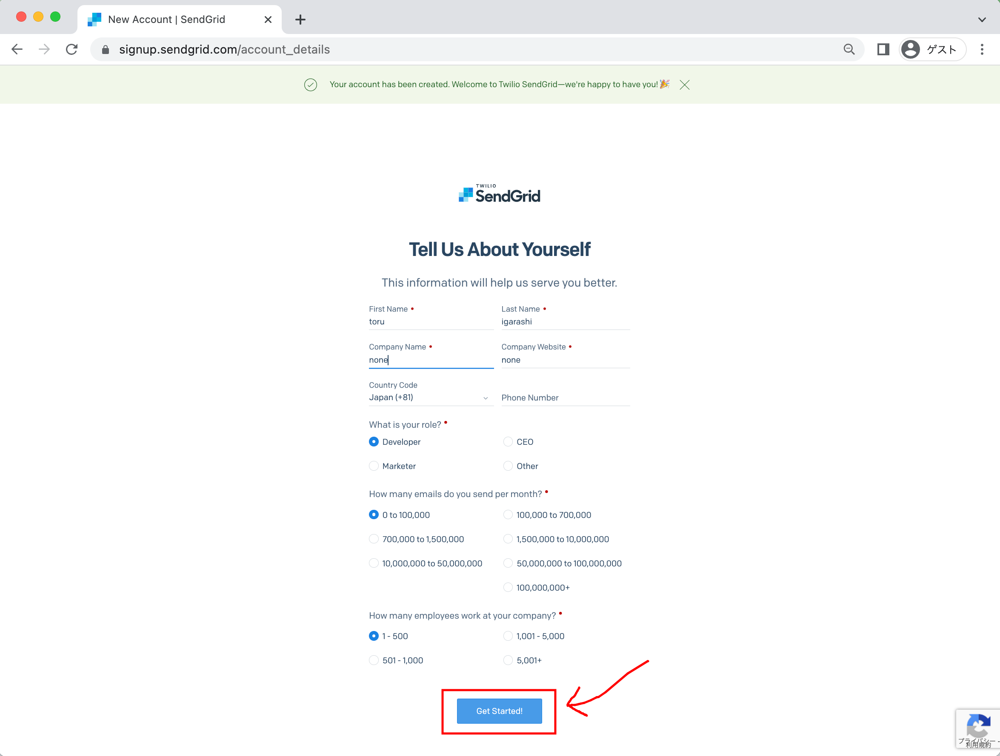

# アカウントの登録方法

## 概要

アカウントの登録方法です

+ メールアドレスと SMS を用いてのアカウント作成方法
+ Google Cloud 経由でのアカウント作成方法

## 登録方法

メールアドレスと SMS を用いてのアカウント作成方法

## 事前に準備しておくもの

+ 登録用のメールアカウント
+ SMS 受け取り用のスマートフォン

## 登録方法

:waring: 2023/06 時点での操作ログです

### 1. https://sendgrid.com/ にアクセス

+ 右上にある `Start for Free` をクリック

### 2. メールアドレスとパスワードの登録

+ メールアドレスとアカウント名を別に登録することも出来る

+ 必要事項が記載できたら、最下部の `Create Account` をクリック

### 3. さらに詳細情報を追記

+ `*` がついている箇所のみで良い

+ 必須項目を埋めると、最下部の `Get Started!` がクリック出来るようになるのでクリックする

+ リダイレクトされるので、登録したメールアドレスとパスワードを入力し `Log In` をクリック

### 4. 登録したメールアドレスの認証

+ 登録したメールアドレスを確認する旨のページが表示される

+ メールボックスを確認すると `support@sendgrid.com` から Two-Factor Authentication のメールが来ているのでクリックする

### 5. 2FA の設定をする

### 5. SendGrid に正式にログインする

Google Cloud 経由でのアカウント作成方法

WIP

